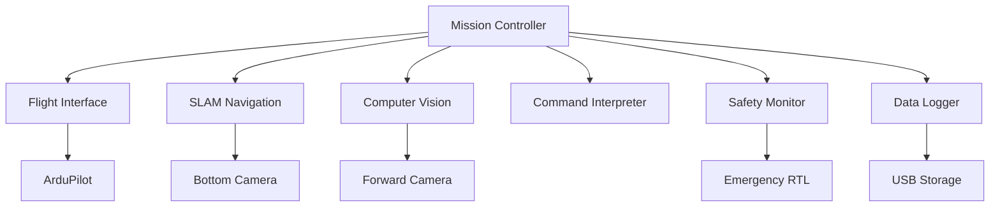

# Aero Companion

Welcome to the repository for [**Aero Companion!**](https://github.com/caddison/AeroCompanion/wiki) This project is dedicated to creating an autonomous drone that boasts cutting-edge capabilities including real-time video streaming, computer vision, and GPS-independent navigation. Below you will find an in-depth overview of the project, including its components and functionalities. 


---

## Project Overview

This project leverages the capabilities of the Raspberry Pi 5 and Pixhawk 6X flight controller to create a cutting-edge drone capable of executing complex autonomous tasks. The drone is designed to operate without GPS, utilizing IMU data and computer vision for navigation.

---

## Key Features

### Autonomous Flight Control
- Utilizes the **Pixhawk 6X** flight controller for precise and reliable flight control.
- Implements AI models developed in Python to handle autonomous navigation and decision-making.

### Real-Time Video Streaming
- Streams live video feed from the drone's 12MP camera to a web application or **Vuzix Blade** smart glasses for FPV (First Person View) experience.
- Provides video transmission over a **Sixfab 4G/LTE cellular modem** for extended range operations.

### Computer Vision and Obstacle Avoidance
- Employs a secondary downward-facing camera for movement tracking and obstacle detection.
- Integrates computer vision algorithms for target tracking, obstacle avoidance, and payload delivery.

### GPS-Free Navigation
- Relies on IMU data and visual tracking for navigation, ensuring continued operation even in GPS-denied environments.

### Modular Design
- Features a modular payload system allowing for easy swapping of sensors and equipment based on mission requirements.
- Designed for versatility, making it suitable for various applications such as surveillance, delivery, and environmental monitoring.

### Enhanced User Interface
- Provides a web-based control interface compatible with mobile devices, featuring joystick controls and voice command capabilities.
- Integrates with **Vuzix Blade AR smart glasses** to offer augmented reality overlays and voice command input.

---

## Technical Specifications

- **Flight Controller**: Pixhawk 6X
- **Processor**: Raspberry Pi 5
- **Camera**: Raspberry Pi Camera
- **Connectivity**: Sixfab 4G/LTE Cellular Modem
- **Materials**: Lightweight and durable 3D-printed mounts and frames

---

## Useful Commands
These commands are designed for a wide range of commercial applications and allow users to utilize the drone for tasks such as inspection, delivery, and surveillance in various industries:

**Move Up / Move Down**: Vertical navigation for getting the drone to the required altitude.

**Pan Left / Pan Right**: Adjust the drone’s orientation for full 360-degree coverage.

**Move Forward / Move Backward**: Basic forward or backward movement for navigating environments.

**Move Left / Move Right**: Rotate the drone to adjust the camera or sensors without changing position.

**Hover**: Stabilize the drone in one place for a detailed inspection or data capture.

**Track**: Automatically follow a moving object, such as a person or vehicle, based on real-time visual data.

**Follow Route**: Pre-program a route using GPS for the drone to follow autonomously.

**Deliver Package**: Navigate to a specific location and release a payload.

**Return to Home**: Command the drone to return to its launch point.

**Capture Data**: Record visual data for later analysis or real-time transmission to the user.

---


# 🚁 Autonomous Drone System Architecture

[](https://python.org)
[](https://opencv.org)
[](https://ultralytics.com)
[](https://mavlink.io)
[](LICENSE)

> **Phase 2**: Transitioning from command-based manual operation to fully autonomous, modular system with USB mission profiles

An intelligent drone system that reads mission objectives from USB and executes autonomous operations using computer vision, SLAM navigation, and safety monitoring.

## 🏗️ System Overview

The architecture consists of **7 independent Python modules** coordinated by a central mission controller:



## 🧠 Core Modules

### 1. 🎯 Mission Controller (Main Brain)

**Purpose:** Central coordinator that orchestrates all other modules

```python
class MissionController:
    def load_program_objectives()      # Parse USB mission files
    def execute_mission_loop()         # Main execution cycle
    def handle_emergency_abort()       # Emergency procedures
    def coordinate_module_communication()  # Inter-module messaging
```

**Key Responsibilities:**
- 📋 Parse Program Objectives from USB
- 🔄 Maintain mission state machine
- 🤝 Coordinate all modules
- ⚡ **Priority**: Safety > Mission > Efficiency

---

### 2. ✈️ Flight Interface Module

**Purpose:** Handles MAVLink communication with ArduPilot

```python
class FlightInterface:
    def connect_to_ardupilot()    # Establish MAVLink connection
    def send_movement_commands()  # Execute flight commands
    def get_telemetry_data()     # Real-time flight data
    def set_flight_modes()       # GUIDED, RTL, LAND modes
```

**Features:**
- 🛰️ Real-time telemetry (GPS, battery, attitude)
- 🎮 Flight mode control
- 📡 MAVLink command handling
- 🛡️ Safety parameter enforcement

---

### 3. 🗺️ SLAM Navigation Module

**Purpose:** Tracks position via visual SLAM using bottom-facing camera

```python
class SLAMNavigator:
    def initialize_home_position()   # Set reference point
    def update_position_estimate()   # Continuous tracking
    def track_relative_movement()    # Movement calculations
    def detect_position_drift()      # Confidence monitoring
```

**Capabilities:**
- 📸 ORB-SLAM implementation
- 🏠 Home position reference
- 🗺️ Real-time map building
- 📊 Drift detection with confidence scoring

---

### 4. 👁️ Computer Vision Module

**Purpose:** Detects and tracks objects using YOLOv8

```python
class VisionProcessor:
    def detect_objects()          # YOLOv8 inference
    def track_targets()          # Multi-object tracking
    def estimate_target_distance() # Distance calculation
    def capture_images_video()    # Media recording
```

**Intelligence:**
- 🤖 Real-time YOLOv8n inference
- 🎯 Multi-object tracking
- 📏 Distance estimation
- 📹 GPS-tagged media capture

---

### 5. 🗣️ Command Interpreter Module

**Purpose:** Converts high-level commands into drone actions

```python
class CommandInterpreter:
    def parse_command()    # Command parsing
    def execute_hover()    # Position holding
    def execute_track()    # Target following
    def execute_surveil()  # Area monitoring
    def execute_goto()     # Waypoint navigation
```

**Supported Commands:**

| Command | Description | Use Case |
|---------|-------------|----------|
| `hover` | Maintain position using computer vision | Stable observation |
| `track` | Follow object at defined distance | Wildlife monitoring |
| `guard` | Circle/patrol an area | Perimeter security |
| `find` | Search pattern for specific target | Search & rescue |
| `surveil` | Observe area/object for duration | Surveillance ops |
| `recon` | Map and scan defined region | Area mapping |
| `goto` | Navigate to coordinates | Waypoint missions |
| `return` | Return home using SLAM/GPS | Mission completion |
| `counter` | Defensive/reactive behavior | Mission completion |

---

### 6. 🛡️ Safety Monitor Module

**Purpose:** Continuous safety and health monitoring

```python
class SafetyMonitor:
    def monitor_battery_levels()      # Power management
    def check_flight_boundaries()     # Geofence enforcement
    def detect_system_failures()      # Health checks
    def initiate_emergency_procedures() # RTL protocols
```

**Safety Features:**
- 🔋 Smart battery reserve calculation
- 🚧 Geofence boundary enforcement
- 💓 System health monitoring
- 🚨 Automatic emergency RTL

---

### 7. 📊 Data Logger Module

**Purpose:** Mission telemetry and data recording

```python
class DataLogger:
    def log_mission_events()     # Event timestamps
    def save_video_images()      # Media storage
    def record_telemetry()       # Flight data
    def generate_mission_report() # Post-mission analysis
```

**Data Management:**
- ⏰ Timestamped event logging
- 📁 Organized media storage
- 📈 Flight path and telemetry logs
- 📋 Automated mission reports

## 📄 Mission Configuration

### Program Objectives File Format

Missions are defined in JSON format on USB drive:

```json
{
  "mission_id": "wildlife_survey_001",
  "metadata": {
    "created": "2024-07-24T10:30:00Z",
    "operator": "research_team",
    "location": "yellowstone_sector_7"
  },
  "parameters": {
    "max_flight_time": 1200,     // seconds
    "battery_reserve": 20,       // percentage
    "max_altitude": 50,          // meters
    "track_distance": 15,        // meters
    "geofence_radius": 500       // meters
  },
  "objectives": [
    {
      "command": "find",
      "target": "bird",
      "area": "circle",
      "radius": 100,
      "timeout": 300,
      "priority": "high"
    },
    {
      "command": "track",
      "duration": 180,
      "distance": 15,
      "record_video": true,
      "follow_mode": "adaptive"
    },
    {
      "command": "surveil",
      "duration": 120,
      "area": "current_position",
      "altitude": 30
    },
    {
      "command": "return",
      "method": "slam_primary"
    }
  ]
}
```

## 🔄 System Flow

### 🚀 Startup Sequence

```
1. 🔌 Boot & Initialize → Load modules & connect flight controller
2. 💾 Mission Load → Parse objectives from USB
3. ✅ Pre-Flight Check → Verify all systems green
4. 🗺️ SLAM Initialize → Set home position reference
5. 🛫 Takeoff → Begin mission at safe altitude
```

### ⚙️ Mission Loop

- 🔍 **Continuous Monitoring**: Safety & health checks every 100ms
- 📋 **Objective Processing**: Parse and execute mission commands
- 🧭 **Sensor Fusion**: SLAM + GPS + vision integration  
- 📊 **Data Recording**: Log all events and telemetry
- 🤔 **Decision Making**: Adaptive behavior based on conditions

### 🚨 Emergency Handling

| Trigger | Response | Fallback |
|---------|----------|----------|
| 🔋 Low Battery | Immediate RTL | Critical landing |
| 🗺️ SLAM Failure | GPS-only mode | Manual override |
| 👁️ Vision Loss | Continue without tracking | Basic waypoints |
| 📡 Comm Loss | Execute RTL protocol | Autonomous return |
| 🚧 Geofence Breach | Forced return | Emergency stop |

## 🗓️ Development Roadmap

### ✅ Phase 1: Foundation *(Completed)*
- [x] Flight Interface Module
- [x] Basic Mission Controller  
- [x] Safety Monitor Framework

### 🔧 Phase 2: Navigation *(Current Phase)*
- [ ] SLAM Navigation Module
- [ ] Command Interpreter (basic commands)
- [ ] USB Program Objectives Parser
- [ ] Integration testing

### 🔍 Phase 3: Intelligence *(Q4 2024)*
- [ ] Computer Vision Module (YOLOv8)
- [ ] Advanced command implementations
- [ ] Data Logger with analytics
- [ ] Machine learning integration

### 🧪 Phase 4: Field Testing *(Q1 2025)*
- [ ] Full module integration
- [ ] Real-world field testing
- [ ] Emergency scenario simulation
- [ ] Performance optimization

## 🛠️ Technical Requirements

### 🖥️ Hardware
- **Computer**: Raspberry Pi 4+ (4GB RAM) or NVIDIA Jetson Nano
- **Cameras**: 
  - Bottom-facing camera (SLAM navigation)
  - Forward-facing camera (computer vision)
- **Storage**: USB 3.0 drive for missions
- **Flight Controller**: ArduPilot-compatible (Pixhawk, etc.)

### 📦 Software Dependencies

```bash
# Core dependencies
pip install opencv-python>=4.5.0
pip install ultralytics>=8.0.0
pip install pymavlink>=2.4.0
pip install numpy>=1.21.0
pip install scipy>=1.7.0

# SLAM dependencies  
pip install orbslam3-python
pip install g2o-python

# Additional utilities
pip install matplotlib>=3.5.0
pip install pillow>=8.0.0
pip install pyyaml>=6.0
```

### 📋 System Requirements
- **OS**: Ubuntu 20.04+ or Raspberry Pi OS
- **Python**: 3.8 or higher
- **Memory**: 4GB RAM minimum (8GB recommended)
- **Storage**: 32GB+ for logs and media
- **Network**: WiFi for telemetry (optional)

## 🚀 Quick Start

```bash
# Clone repository
git clone https://github.com/yourusername/autonomous-drone-system.git
cd autonomous-drone-system

# Install dependencies
pip install -r requirements.txt

# Configure settings
cp config/default.yaml config/local.yaml
# Edit local.yaml with your settings

# Run system check
python scripts/system_check.py

# Start mission controller
python main.py --config config/local.yaml
```

## 📖 Documentation

- [📘 Installation Guide](docs/installation.md)
- [🎯 Mission Planning](docs/mission-planning.md)
- [⚙️ Configuration Reference](docs/configuration.md)
- [🔧 Hardware Setup](docs/hardware-setup.md)
- [🛠️ Troubleshooting](docs/troubleshooting.md)
- [📊 API Reference](docs/api-reference.md)

## 🤝 Contributing

We welcome contributions! Please see our [Contributing Guidelines](CONTRIBUTING.md) for details.

1. Fork the repository
2. Create your feature branch (`git checkout -b feature/amazing-feature`)
3. Commit your changes (`git commit -m 'Add amazing feature'`)
4. Push to the branch (`git push origin feature/amazing-feature`)
5. Open a Pull Request

## 📜 License

This project is licensed under the MIT License - see the [LICENSE](LICENSE) file for details.

## 🙏 Acknowledgments

- **ArduPilot Community** for flight controller integration
- **Ultralytics** for YOLOv8 computer vision
- **OpenCV Team** for computer vision libraries
- **ORB-SLAM Authors** for SLAM implementation

## 📞 Support

- 🐛 **Issues**: [GitHub Issues](https://github.com/yourusername/autonomous-drone-system/issues)
- 💬 **Discussions**: [GitHub Discussions](https://github.com/yourusername/autonomous-drone-system/discussions)
- 📧 **Email**: support@yourproject.com

---

⭐ **Star this repository if you find it helpful!**

[](https://github.com/yourusername/autonomous-drone-system)
