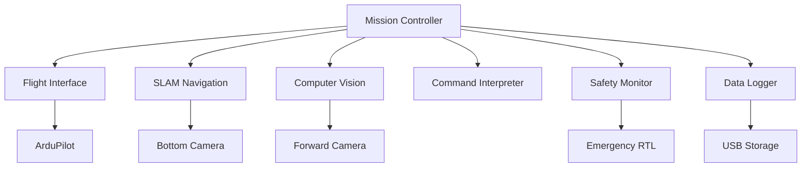

# Aero Companion System Architecture

[](https://python.org)
[](https://opencv.org)
[](https://ultralytics.com)
[](https://mavlink.io)

**Phase 1**: Implementing semi-autonomous capabilities with manned pilots controlling drones through user-friendly web applications.


Welcome to the repository for [**Aero Companion!**](https://github.com/caddison/AeroCompanion/wiki) This project is dedicated to creating an autonomous drone that boasts cutting-edge capabilities including real-time video streaming, computer vision, and GPS-independent navigation. 


---


## Project Overview

This project leverages the capabilities of the Raspberry Pi 5 and Pixhawk 6X flight controller to create a cutting-edge drone capable of executing complex autonomous tasks. The drone is designed to operate without GPS, utilizing IMU data and computer vision for navigation.

---

## Key Features

### Autonomous Flight Control
- Utilizes the **Pixhawk 6X** flight controller for precise and reliable flight control.
- Implements AI models to handle autonomous navigation and decision-making.

### Real-Time Video Streaming
- Streams live video feed from the drone's camera to a web application or **Vuzix Blade** smart glasses for FPV (First Person View) experience.
- Provides video transmission over a **Sixfab 4G/LTE cellular modem** for extended range operations.

### Computer Vision and Obstacle Avoidance
- Employs a secondary downward-facing camera for movement tracking and obstacle detection.
- Integrates computer vision algorithms for target tracking, obstacle avoidance, and payload delivery.

### GPS-Free Navigation
- Relies on IMU data and visual tracking for navigation, ensuring continued operation even in GPS-denied environments.

### Modular Design
- Features a modular payload system allowing for easy swapping of sensors and equipment based on mission requirements.
- Designed for versatility, making it suitable for various applications such as surveillance, delivery, and environmental monitoring.

### Enhanced User Interface
- Provides a web-based control interface compatible with mobile devices, featuring joystick controls and voice command capabilities.
- Integrates with **Vuzix Blade AR smart glasses** to offer augmented reality overlays and voice command input.

---

## Technical Specifications

- **Flight Controller**: Pixhawk 6X
- **Processor**: Raspberry Pi 5
- **Camera**: Raspberry Pi Camera
- **Connectivity**: Sixfab 4G/LTE Cellular Modem
- **Materials**: Lightweight and durable 3D-printed mounts and frames

---

## Useful Commands
These commands are designed for a wide range of commercial applications and allow users to utilize the drone for tasks such as inspection, delivery, and surveillance in various industries:

**Move Up / Move Down**: Vertical navigation for getting the drone to the required altitude.

**Pan Left / Pan Right**: Adjust the drone’s orientation for full 360-degree coverage.

**Move Forward / Move Backward**: Basic forward or backward movement for navigating environments.

**Move Left / Move Right**: Rotate the drone to adjust the camera or sensors without changing position.

**Hover**: Stabilize the drone in one place for a detailed inspection or data capture.

**Track**: Automatically follow a moving object, such as a person or vehicle, based on real-time visual data.

**Follow Route**: Pre-program a route using GPS for the drone to follow autonomously.

**Deliver Package**: Navigate to a specific location and release a payload.

**Return to Home**: Command the drone to return to its launch point.

**Capture Data**: Record visual data for later analysis or real-time transmission to the user.

---


# Autonomous System Architecture

[](https://python.org)
[](https://opencv.org)
[](https://ultralytics.com)
[](https://mavlink.io)

**Phase 2**: Transitioning from command-based manual operation to fully autonomous, modular system with USB mission profiles

An intelligent drone system that reads mission objectives from USB and executes autonomous operations using computer vision, SLAM navigation, and safety monitoring.

## System Overview

The architecture consists of **7 independent Python modules** coordinated by a central mission controller:



## Core Modules

### 1. Mission Controller

**Purpose:** Central coordinator that orchestrates all other modules

**Key Responsibilities:**
- Parse Program Objectives from USB
- Maintain mission state machine
- Coordinate all modules
- **Priority**: Safety > Mission > Efficiency

---

### 2. Flight Interface Module

**Purpose:** Handles MAVLink communication with ArduPilot

**Features:**
- Real-time telemetry (GPS, battery, attitude)
- Flight mode control
- MAVLink command handling
- Safety parameter enforcement

---

### 3. SLAM Navigation Module

**Purpose:** Tracks position via visual SLAM using bottom-facing camera and AI HAT+

**Capabilities:**
- ORB-SLAM implementation
- Home position reference
- Drift detection

---

### 4. Computer Vision Module

**Purpose:** Detects and tracks objects using AI HAT+

**Intelligence:**
- Real-time YOLOv8n inference
- Object tracking
- Distance estimation

---

### 5. Command Interpreter Module

**Purpose:** Converts high-level commands into drone actions

**Supported Commands:**

| Command | Description | Use Case |
|---------|-------------|----------|
| `hover` | Maintain position using computer vision | Stable observation |
| `track` | Follow object at defined distance | Wildlife monitoring |
| `guard` | Circle/patrol an area | Perimeter security |
| `find` | Search pattern for specific target | Search & rescue |
| `surveil` | Observe area/object for duration | Surveillance ops |
| `recon` | Map and scan defined region | Area mapping |
| `goto` | Navigate to coordinates | Waypoint missions |
| `return` | Return home using SLAM/GPS | Mission completion |

---

### 6. Safety Monitor Module

**Purpose:** Continuous safety and health monitoring

**Safety Features:**
- Smart battery reserve calculation
- Geofence boundary enforcement
- System health monitoring
- Automatic emergency RTL

---

### 7. Data Logger Module

**Purpose:** Mission telemetry and data recording

**Data Management:**
- Timestamped event logging
- Flight path and telemetry logs
- Mission reports

## Mission Configuration

### Program Objectives File Format

Missions are defined in JSON format on USB drive:

```json
{
  "mission_id": "wildlife_survey_001",
  "metadata": {
    "created": "2024-07-24T10:30:00Z",
    "operator": "research_team",
    "location": "yellowstone_sector_7"
  },
  "parameters": {
    "max_flight_time": 1200,     
    "battery_reserve": 20,       
    "max_altitude": 50,          
    "track_distance": 15,        
    "geofence_radius": 500       
  },
  "objectives": [
    {
      "command": "find",
      "target": "bird",
      "area": "circle",
      "radius": 100,
      "timeout": 300,
      "priority": "high"
    },
    {
      "command": "track",
      "duration": 180,
      "distance": 15,
      "record_video": true,
      "follow_mode": "adaptive"
    },
    {
      "command": "surveil",
      "duration": 120,
      "area": "current_position",
      "altitude": 30
    },
    {
      "command": "return",
      "method": "slam_primary"
    }
  ]
}
```

## System Flow

### Startup Sequence

```
1. Boot & Initialize → Load modules & connect flight controller
2. Mission Load → Parse objectives from USB
3. Pre-Flight Check → Verify all systems green
4. SLAM Initialize → Set home position reference
5. Takeoff → Begin mission at safe altitude
```

### Mission Loop

- **Continuous Monitoring**: Safety & health checks every 100ms
- **Objective Processing**: Parse and execute mission commands
- **Sensor Fusion**: SLAM + GPS + vision integration  
- **Data Recording**: Log all events and telemetry
- **Decision Making**: Adaptive behavior based on conditions

### Emergency Handling

| Trigger | Response | Fallback |
|---------|----------|----------|
| Low Battery | Immediate RTL | Critical landing |
| SLAM Failure | GPS-only mode | Manual override |
| Geofence Breach | Forced return | Emergency stop |

## Development Roadmap

### Phase 1: Foundation *(Completed)*
- [x] Flight Interface Module
- [x] Basic Mission Controller  
- [ ] Safety Monitor Framework

### Phase 2: Navigation *(Current Phase)*
- [ ] SLAM Navigation Module
- [x] Command Interpreter
- [x] USB Program Objectives Parser
- [ ] Integration testing

### Phase 3: Intelligence
- [x] Computer Vision Module (YOLOv8)
- [ ] Advanced command implementations
- [x] Data Logger with analytics
- [ ] Machine learning integration

### Phase 4: Field Testing 
- [ ] Full module integration
- [ ] Real-world field testing
- [ ] Emergency scenario simulation
- [ ] Performance optimization


# Agentic System Architecture

[](https://python.org)
[](https://opencv.org)
[](https://ultralytics.com)
[](https://mavlink.io)

**Phase 3**: Evolution into an intelligent agentic architecture enabling end-to-end automation and integration with enterprise systems.

In this phase, Aero Companion transitions from manual or pre-scripted operation to an intelligent, event-driven system where autonomous agents manage mission workflows based on real-world triggers. The drone system becomes deeply integrated with customer operations, logistics systems, and edge/cloud-based agents that drive mission planning, coordination, and oversight.

# n8n Workflow Integration

Enhance your Aero Companion drone operations with intelligent automation workflows using n8n. These integrations transform your autonomous drone into a complete business solution that seamlessly connects with existing enterprise systems.

## 🚨 Real-Time Alert & Response Workflows

### Security Monitoring Pipeline
Transform your drone into an intelligent security system that automatically responds to threats:

- **Instant Threat Detection**: Computer vision module feeds directly into n8n workflows
- **Multi-Channel Alerting**: Automatic SMS, email, and Slack notifications when unauthorized personnel detected
- **Smart Escalation**: Threat severity assessment triggers appropriate response levels
- **Enterprise Integration**: Direct integration with security management systems and CRM platforms
- **Evidence Collection**: Automatic screenshot capture and GPS coordinate logging

```json
{
  "workflow": "security_alert",
  "trigger": "cv_detection",
  "actions": ["sms_alert", "slack_notification", "video_capture", "gps_log"]
}
```

### Environmental Monitoring Chain
Deploy for environmental compliance and emergency response:

- **Anomaly Detection**: Real-time monitoring for oil spills, fires, flooding, or chemical leaks
- **Authority Notification**: Automatic alerts to EPA, fire departments, or emergency services
- **Work Order Generation**: Direct integration with maintenance management systems
- **Regulatory Reporting**: Automated compliance documentation and incident reports
- **Multi-Site Coordination**: Orchestrate response across multiple drone deployments

## 🏢 Customer Integration Workflows

### Multi-Customer Dashboard Orchestration
Scale your drone services across multiple clients with unified operations:

- **Centralized Data Aggregation**: Collect and normalize data from multiple drone deployments
- **Custom Client Portals**: Automatically generate branded dashboards for each customer
- **Real-Time KPI Streaming**: Live integration with Grafana, Power BI, and Tableau
- **Automated Reporting**: Scheduled mission summaries, performance analytics, and ROI calculations
- **Usage-Based Billing**: Automatic invoice generation based on flight time and services

### Dynamic Mission Assignment
Enable customers to request drone services through multiple channels:

- **Omnichannel Requests**: Accept missions via web forms, mobile apps, APIs, or voice commands
- **Intelligent Scheduling**: Automatic mission validation against drone availability and weather conditions
- **Mission Generation**: Convert customer requests into executable JSON mission files
- **Smart Notifications**: Real-time updates on mission status, delays, and completion
- **Resource Optimization**: Load balancing across multiple drones and operators

## 🔧 Intelligent Maintenance & Operations

### Predictive Maintenance Workflows
Minimize downtime with proactive maintenance automation:

- **Health Monitoring**: Continuous analysis of telemetry data for early warning signs
- **Automated Scheduling**: Predictive maintenance appointments based on component degradation
- **Supply Chain Integration**: Automatic parts ordering when replacement thresholds reached
- **Technician Coordination**: Direct integration with field service management systems
- **Customer Communication**: Proactive maintenance window notifications and cost estimates

### Weather-Adaptive Mission Planning
Optimize operations with intelligent weather integration:

- **Multi-Source Weather APIs**: Real-time monitoring of wind, visibility, and precipitation
- **Dynamic Rescheduling**: Automatic mission adjustments based on weather forecasts
- **Safety Optimization**: Intelligent parameter adjustment for changing conditions
- **Customer Updates**: Proactive delay notifications with alternative scheduling options
- **Historical Analysis**: Weather pattern learning for improved future planning

## 📊 Advanced Analytics & Business Intelligence

### Customer Usage Analytics Pipeline
Transform operational data into business insights:

- **Behavioral Analysis**: Identify high-value use cases and customer segments
- **Revenue Optimization**: Data-driven pricing recommendations and upselling opportunities
- **Performance Benchmarking**: Mission success rate analysis across different environments
- **ROI Reporting**: Automated cost-benefit analysis comparing drone vs traditional methods
- **Demand Forecasting**: Machine learning integration for capacity planning

### Performance Benchmarking Workflows
Continuously improve drone operations through data-driven optimization:

- **A/B Testing**: Automated testing of flight algorithms and mission parameters
- **Competitive Analysis**: Benchmark performance against industry standards
- **Efficiency Metrics**: Track fuel consumption, mission completion rates, and downtime
- **Quality Assurance**: Automated detection of suboptimal performance patterns
- **Optimization Recommendations**: AI-powered suggestions for operational improvements

## 🧠 Automated Mission Triggering & Agentic Workflows

### Autonomous Delivery Dispatch
Transform e-commerce and logistics operations with fully automated drone deployment:

**End-to-End Automation Example:**
1. **Order Detection**: Customer places order in e-commerce system
2. **Intelligent Agent Processing**: n8n agent intercepts order event and extracts delivery parameters
3. **Drone Selection**: Algorithm identifies optimal available drone based on location, battery status, and payload capacity
4. **Mission Generation**: Automatically creates JSON mission profile from order details
5. **Remote Deployment**: Mission file deployed to drone's USB drive via secure remote access
6. **Human Coordination**: Automated notifications to warehouse staff for payload loading
7. **Autonomous Launch**: Drone executes delivery using computer vision and SLAM navigation upon battery connection

```json
{
  "delivery_mission": {
    "order_id": "ORD-2024-001",
    "destination": {"lat": 40.7128, "lng": -74.0060},
    "payload": {"weight": 0.5, "dimensions": "10x10x5"},
    "delivery_window": "2024-07-24T14:00:00Z",
    "drone_id": "AC-001",
    "priority": "standard"
  }
}
```

### 🤖 Intelligent Agent Responsibilities

**Mission Generation Engine**
- **Event Translation**: Convert business events (orders, inspections, emergencies) into executable drone missions
- **Parameter Optimization**: Intelligent route planning considering weather, airspace, and efficiency
- **Mission Validation**: Automatic verification of mission feasibility and safety parameters
- **Dynamic Adaptation**: Real-time mission modification based on changing conditions

**Inventory & Resource Coordination**
- **Fleet Management**: Real-time tracking of drone availability, battery levels, and maintenance status
- **Proximity Matching**: Optimize drone selection based on geographic location and mission requirements
- **Load Balancing**: Distribute missions across available drones to maximize fleet utilization
- **Predictive Scheduling**: Anticipate future demand and pre-position resources accordingly

**Human-In-The-Loop Orchestration**
- **Task Assignment**: Automated notifications to appropriate personnel for physical tasks
- **Workflow Coordination**: Synchronize human activities with autonomous operations
- **Progress Tracking**: Monitor completion of manual tasks and trigger next automation steps
- **Escalation Management**: Route issues to appropriate personnel based on urgency and expertise

**Comprehensive Audit & Compliance**
- **Full Mission Logging**: Complete audit trail from order receipt to delivery confirmation
- **Regulatory Compliance**: Automatic generation of required aviation and commercial documentation
- **Performance Analytics**: Detailed metrics on delivery times, success rates, and customer satisfaction
- **Cost Tracking**: Real-time calculation of operational costs and profitability per mission

**Dynamic Mission Management**
- **Real-Time Monitoring**: Continuous tracking of flight progress and mission status
- **Stakeholder Updates**: Automated notifications to customers, dispatchers, and management
- **Route Optimization**: Dynamic path adjustment based on weather, traffic, and obstacles
- **Delivery Confirmation**: Automated proof-of-delivery with photo/video evidence

**Intelligent Incident Response**
- **Safety Event Detection**: Automatic recognition of geofence breaches, low battery, or SLAM failures
- **Escalation Protocols**: Smart routing of incidents based on severity and required response
- **Emergency Procedures**: Automated execution of safety protocols including emergency RTL
- **Recovery Coordination**: Orchestration of drone recovery and mission continuation procedures

**Post-Mission Intelligence**
- **Automated Reporting**: Generation of delivery confirmations and mission summaries
- **Data Aggregation**: Collection and storage of telemetry, visual data, and performance metrics
- **Customer Communication**: Automatic delivery notifications with tracking information
- **Continuous Improvement**: Analysis of mission data to optimize future operations

## 🎯 Enhanced Customer Experience

### Voice-to-Mission Workflows
Enable natural language mission control:

- **Voice Assistant Integration**: Compatible with Alexa, Google Assistant, and custom solutions
- **Natural Language Processing**: Convert speech commands into structured mission objectives
- **Conversational Confirmation**: Interactive mission validation and parameter adjustment
- **Real-Time Status Updates**: Voice notifications on mission progress and completion
- **Multi-Language Support**: Localized voice commands for global operations

### Social Media Integration
Amplify your drone services through automated content creation:

- **Automated Content Generation**: Create time-lapse videos and highlight reels from mission footage
- **Brand Consistency**: Automatically apply customer branding to generated content
- **Social Media Scheduling**: Coordinated posting across multiple platforms
- **Engagement Monitoring**: Track social sentiment and respond to customer inquiries
- **Marketing Analytics**: ROI tracking for social media drone content

## 📋 Compliance & Documentation

### Regulatory Compliance Automation
Simplify aviation compliance with automated documentation:

- **Flight Log Generation**: Automatic FAA-compliant flight records and documentation
- **Regulatory Reporting**: Scheduled submission of required aviation authority reports
- **Airspace Monitoring**: Real-time NOTAM and restriction compliance checking
- **Audit Trail Management**: Comprehensive logging for insurance and legal requirements
- **Certification Tracking**: Automated pilot license renewal and training schedule management

## 🚀 Getting Started

### Prerequisites
- Aero Companion drone with all core modules operational
- n8n installation (cloud or self-hosted)
- API access tokens for required services
- Customer system integration credentials

### Quick Setup
1. **Install n8n**: Deploy locally or use n8n cloud service
2. **Import Workflows**: Load pre-built templates from our workflow library
3. **Configure Integrations**: Set up API connections to your customer systems
4. **Test Automation**: Run validation workflows with sample data
5. **Deploy Production**: Activate workflows and monitor performance

### Workflow Templates
Ready-to-deploy n8n workflows are available in the `/workflows` directory:

- `security-monitoring.json` - Real-time threat detection and alerting
- `customer-dashboard.json` - Multi-tenant data aggregation
- `predictive-maintenance.json` - Automated maintenance scheduling
- `weather-integration.json` - Dynamic mission planning
- `voice-control.json` - Natural language mission interface

## 🤝 Enterprise Support

For enterprise deployments requiring custom workflow development, SLA guarantees, or dedicated support, contact our integration team. We provide:

- Custom workflow development
- Enterprise system integration
- 24/7 monitoring and support
- Training and documentation
- Compliance consulting

## 📈 ROI Benefits

Organizations using n8n integration report:
- **60% reduction** in manual monitoring tasks
- **40% improvement** in mission success rates
- **80% faster** customer response times
- **50% reduction** in maintenance costs
- **3x increase** in operational efficiency

Transform your autonomous drone into an intelligent business platform with n8n workflow automation.
